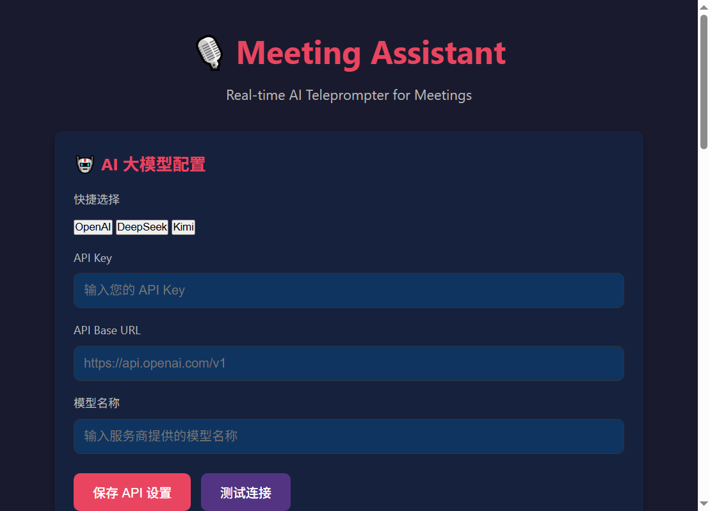
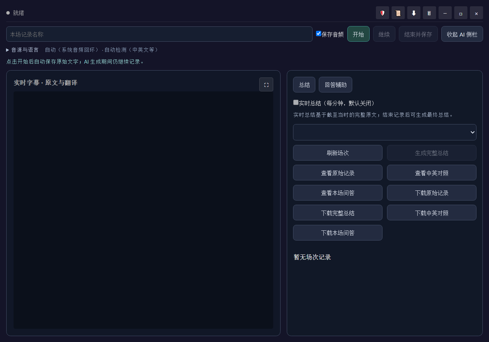

# Meeting Assistant

一个面向 Windows 的本地会议工作台：使用本地 faster-whisper 识别会议声音，实时显示中英字幕，可选生成实时/完整总结，并保留原来的面试回答辅助与知识库功能。

Windows ZIP 包发布后，个人用户可从 [Releases](https://github.com/marksharkkk/live-meeting-interview-assistant/releases) 下载，解压后运行 `MeetingAssistant.exe`。如果页面没有 ZIP 附件，说明下载版尚未发布，请不要把 GitHub 自动生成的“Source code”压缩包当成免安装版。下载版无需安装 Node.js、Python、uv 或 Volta；首次使用请在主界面“语音识别设置”点击“下载语音识别模型”，看到“已就绪”后再开始监听。之后可离线识别。开发者从源码运行则按下文安装依赖。

**许可：** 本项目公开源码，但不是开放源代码许可。仅授权个人非商业使用未修改版本；修改、商用或再分发须先取得作者书面授权。详见 [LICENSE](./LICENSE)。版本变化见 [CHANGELOG](./CHANGELOG.md)。

ZIP 发布版的用户数据在 `%APPDATA%\meeting-assistant\`（包括 `.env`、`meetings`、`knowledge_base`、`whisper_models` 和 `logs`）；英译中模型随程序放在解压目录，可选的自装模型放在用户数据目录的 `translation_models`。下文的项目内路径只适用于源码运行版。




当前版本将“会议记录”和“面试/回答辅助”合并到同一场连续会话中：一次开始即可同时保存原始记录、翻译、音频和回答结果。

第一次使用请先看：[会议通使用指南｜小白版](./会议通_使用指南.html)

## 核心功能

### 1. 语音识别
- 实时监听会议对话
- 语音转录后手动提交问题
- 支持多语言（中文、英文、日语、韩语等）

### 2. AI 答案生成
- 根据最近字幕或手动输入的问题生成便于口头表达的回答
- 集成知识库，提供精准答案
- 支持中文、英文或跟随问题语言

### 3. 统一工作台
- 无边框、置顶的实时字幕与 AI 侧栏
- 会议记录、回答辅助可以随时切换，不会切断当前监听
- 隐私模式启用系统级内容保护，并降低窗口可见度
- 支持普通最小化、全屏字幕和隐私快捷键

### 4. 知识库管理
- 支持上传 PDF、TXT、DOCX 文件
- 支持直接输入文本
- 文档自动切块，支持中英文关键词检索

### 5. 快捷键操作
- `Ctrl + H` - 隐藏/恢复全部会议通窗口及任务栏入口
- `Ctrl + Shift + M` - 正常最小化/恢复设置窗口
- `Esc` - 保存正在记录的会议并彻底退出程序（全局快捷键，包括隐私隐藏期间）
- 提词器最小化按钮保留任务栏入口，点击任务栏图标可恢复

### 6. 记录与导出
- 每场会议独立保存原始文字、音频、翻译、回答和总结
- 可查看/下载原始记录、中英对照、本场问答和完整总结
- 最近 50 条答案历史保存在本机浏览器存储
- 清空字幕显示不会删除磁盘上的原始记录

### 7. 双语实时字幕
- 原文先显示，译文随后显示，适合会议中的双语对照
- 连续讲话时会先显示可替换的“实时预览译文”；检测到完整句尾后才固化最终译文，避免把半句话误译后写入记录
- Windows 下载版已内置英译中 OPUS-MT 模型，本地翻译优先；源码版可按下文自行安装
- 中文译英文目前没有内置本地模型；本地模型缺失或失败时才回退到当前配置的大模型翻译

## 技术架构

### 前端：Electron
- 设置窗口：API 配置、知识库管理、语音设置
- 提词器窗口：无边框、置顶、隐私保护

### 后端：Python (FastAPI)
- 语音识别：faster-whisper + PyAudio
- 大模型：OpenAI API（支持自配API Key）
- 知识库：LangChain 文档加载 + 本地关键词检索

### 本地安全
- 桌面端与后端之间使用每次启动随机生成的访问令牌
- 上传文件限制为 PDF、TXT、DOCX，单个文件最大 25 MB
- Electron 渲染页面禁用 Node 集成，并启用内容安全策略
- API Key 只写入项目本地的 `backend/.env`，界面不会回显密钥
- 在主界面点击“下载语音识别模型”后，Whisper 模型保存在 `backend/whisper_models/base`，不占用用户级模型缓存

## 数据位置与 GitHub 安全

以下内容属于本机运行数据，不应提交到 GitHub，项目已经在 `.gitignore` 中排除：

| 内容 | 本机位置 |
| --- | --- |
| API Key 和本地配置 | `backend/.env` |
| 会议元信息、原始记录、翻译、回答、总结和 WAV 音频 | `backend/meetings/<会议ID>/` |
| 知识库上传原文和缓存 | `backend/knowledge_base/` |
| Whisper 模型 | `backend/whisper_models/` |
| OPUS-MT 模型和下载压缩包 | `backend/translation_models/` |
| 桌面端运行日志 | `logs/desktop.log` |
| Python/Node 隔离环境 | `.venv/`、`node_modules/` |

公开仓库只保留 `backend/.env.example`，不要把真实的 `backend/.env`、会议音频、会议文字、知识库原文、API Key 或模型文件加入提交。

> 隐私模式在 Windows 上会请求系统将窗口排除在大多数屏幕捕获之外。不同会议或录屏软件的实现可能不同，正式会议前请先用实际软件测试一次。

## 安装与运行

首次使用先在 Windows 中安装两个项目工具。它们不是业务运行时：uv 用来按 `uv.lock` 创建并同步项目 `.venv`，Volta 用来按 `package.json` 固定 Node.js/npm 并执行 `npm ci`。

```bash
winget install --id=astral-sh.uv -e
winget install --id=Volta.Volta -e
```

安装后重新打开终端，再双击 `install.bat`。脚本会根据 `.python-version`、`uv.lock`、`package.json` 和 `package-lock.json` 恢复隔离环境；它不会在发现 uv/Volta 缺失时自动替用户安装这两个工具。

### 手动恢复环境

```bash
uv sync --locked
volta run npm ci
```

### 配置 API Key

复制并编辑配置文件：

```bash
cd backend
copy .env.example .env
```

编辑 `.env` 文件，填入你的 API Key：

```
OPENAI_API_KEY=your-api-key-here
OPENAI_API_BASE=https://api.openai.com/v1
OPENAI_MODEL=gpt-4
```

### 启动应用

```bash
start.bat
```

### 可选：安装本地中英翻译

这一步不是启动应用的前置条件。网络可用时，在项目根目录运行：

```powershell
powershell -ExecutionPolicy Bypass -File .\scripts\setup_local_translation.ps1
```

脚本会把 OPUS-MT 运行时装进项目 `.venv`，下载并转换英文→中文翻译模型到
`backend/translation_models`。模型文件不应提交到 Git；没有本地模型时，程序仍会使用配置的大模型翻译。
如果你已经手动下载官方 ZIP，请放到 `backend/translation_models/.downloads`；脚本支持
`opus-mt-en-zh.zip`，也支持浏览器默认文件名 `opus-2020-07-17.zip`。

或者分别启动：

```bash
cd backend
..\.venv\Scripts\python.exe main.py

cd ..
volta run npm start
```

## 使用指南

### 统一工作台

提词器中的“开始”会建立一场会话并启动监听。会话期间可以：

- 在“音源与语言”中选择系统音频回环、麦克风或自动检测，以及自动/中文/英文识别；
- 选择中英互译、固定目标语言或关闭翻译；
- 按需开启每分钟实时总结；
- 切换到“回答辅助”，使用最近问题、选中的字幕或手动输入生成答案；
- 暂停/继续同一场会话，或点击“结束并保存”完成归档。

完整总结应在结束记录后生成；回答生成期间不会停止监听。

### 知识库怎么用

知识库入口在主设置窗口的“知识库管理”区域，不在提词器字幕面板中。支持上传 PDF、TXT、DOCX，或直接粘贴文本；单个文件最大 25 MB。上传并显示“已加载”后，提词器的“回答辅助”会默认检索知识库，为答案提供相关参考。

知识库只参与回答辅助，不改变语音识别、翻译或会议总结。文件保存在 `backend/knowledge_base/uploads`，索引缓存在 `backend/knowledge_base/kb_cache.json`，均属于本机数据并已被 `.gitignore` 排除。

每场会议保存在 `backend/meetings/<会议ID>/`：`meeting.json` 是元信息，
`transcript.jsonl` 和 `transcript.txt` 是带识别完成时间的原始转录，`translations.jsonl` 是翻译结果，
`answers.jsonl` 是本场回答，`audio-*.wav` 是采集的单声道 PCM，
`live-summary.txt` 和 `summary.txt` 分别是实时和完整总结。历史会议可在工作台中选择、查看和下载。
完整总结从后端读取全部原始转录，长会议会分段提取再合并，不使用被编辑的字幕或上一份实时总结代替原文。
音频来自当前选择的输入设备，默认系统回环只含电脑播放声音，不自动混入自己的麦克风；暂停期间不录音。
原始转录是语音识别结果，仍可能有识别错误；清空/编辑字幕不会改变磁盘上的原始转录。
以上会议文件由 Git 忽略。

### 1. 首次使用
- 打开设置窗口，配置 API Key
- 点击 "Test Connection" 测试连接
- 上传文档到知识库（可选）
- 选择语音识别语言

### 2. 开始使用提词器
- 点击“打开提词器”打开统一工作台
- 选择音源和识别语言
- 填写本场名称，点击“开始”
- 需要回答时切换“回答辅助”，确认问题后点击“生成答案”

### 3. 会议中操作
- “暂停”只暂停当前采集，点击“继续”仍属于同一场记录
- “实时总结”默认关闭，开启后每分钟更新
- “清空字幕显示”只清理当前视图，不删除原始记录
- 结束后可生成完整总结并下载各类记录

## 参考软件功能对比

本软件参考了 Cheapest Interview 的设计，包含以下相似功能：

| 功能 | Cheapest Interview | Meeting Assistant |
|------|-------------------|-------------------|
| 语音识别 | ✓ | ✓ |
| AI 答案生成 | ✓ | ✓ |
| 知识库支持 | ✓ | ✓ |
| 自定义 API Key | ✓ | ✓ |
| 隐私窗口模式 | ✓ | ✓ |
| 悬浮窗 | ✓ | ✓ |
| 快捷键 | ✓ | ✓ |
| 多语言 | 部分 | ✓ |

## 注意事项

- 请确保 API Key 有效且余额充足
- 首次启动需等待本地服务就绪；首次监听前需在主界面点击下载 Whisper base 模型，并等待显示“已就绪”
- 提词器窗口为不透明置顶工作台，请合理摆放位置
- 本软件仅用于辅助会议，请合理使用

## 技术栈

- Electron 44
- FastAPI
- LangChain
- faster-whisper + PyAudio
- OpenAI API

## 开发计划

- [ ] 支持更多大模型提供商（通义千问、Kimi、Gemini）
- [ ] 优化语音识别准确率
- [x] 增加答案历史记录与会议记录导出
- [ ] 支持多语言答案输出
- [ ] 优化性能，降低延迟
